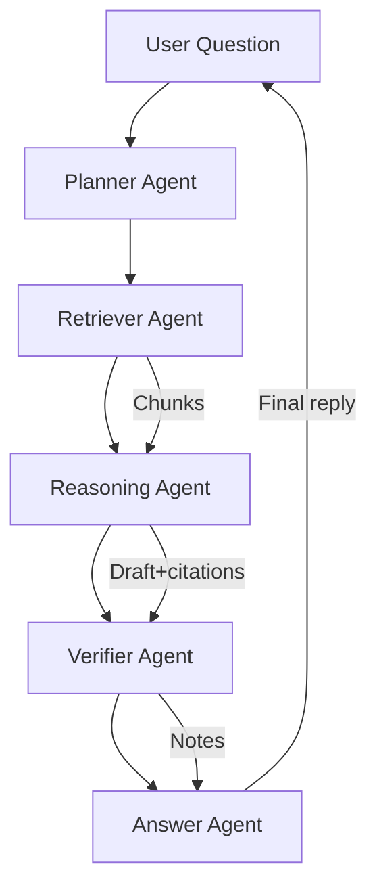

# Agentic RAG System

Multi-agent Retrieval-Augmented Generation stack purpose-built for grounded, high-confidence answers sourced from enterprise corpora. Every surface (CLI, Streamlit UI, and orchestration pipelines) is pinned to **Claude Sonnet 4.5** by default while still offering a fallback to local Ollama models when policy allows.

---

## Highlights

- **Agentic workflow**: planner → retriever → reasoning → verifier → answer agents coordinate via LangChain primitives and shared prompts.
- **Strict model governance**: `config/model_config.yaml` enforces Claude Sonnet 4.5 for every client, with an auditable fallback section for Ollama-based deployments.
- **Vector-first retrieval**: optimized chunking plus Chroma persistence gives reproducible semantic indexing, reloadable across sessions.
- **Evaluation harness**: adversarial suites, hallucination smoke tests, and experiment scripts make it easy to monitor regression risk.

---

## Architecture



### Agent Roles

| Agent | Responsibility | Claude Policy |
| --- | --- | --- |
| Planner | Break questions into executable sub-goals | Claude Sonnet 4.5 enforced |
| Retriever | Score and filter Chroma chunks | Claude Sonnet 4.5 enforced |
| Reasoning | Produce grounded draft with inline citations | Claude Sonnet 4.5 enforced |
| Verifier | Self-critique and flag unsupported claims | Claude Sonnet 4.5 enforced |
| Answer | Deliver final, user-facing response | Claude Sonnet 4.5 enforced |

---

## Enforcing "Enable Claude Sonnet 4.5 for all clients"

- `config/model_config.yaml` sets `enable_claude_sonnet_4_5: true` plus a `client_policy` block covering CLI, Streamlit, and API clients.
- `tools/model_factory.py` reads the policy and forces every agent instantiation to request Claude Sonnet 4.5 through `langchain-anthropic`.
- If `ANTHROPIC_API_KEY` is missing the process halts with an explicit error, preventing accidental downgrade.
- A fallback Ollama profile is defined but only used if you explicitly set `enable_claude_sonnet_4_5: false`.

---

## Project Structure

```
Agentic_RAG_System/
├── app/                    # CLI + Streamlit entrypoints
├── agents/                 # Planner, retriever, reasoning, verifier, answer
├── config/                 # Model policy + prompts + retriever settings
├── data/                   # Raw PDFs and processed chunk dumps
├── embeddings/             # Persisted Chroma store
├── evaluation/             # Adversarial queries + harness
├── experiments/            # Ablation utilities
├── pipelines/              # Ingestion + RAG orchestration
├── tests/                  # Policy regression tests
├── tools/                  # Shared utilities (LLM factory, embeddings, etc.)
├── requirements.txt
└── README.md
```

---

## Getting Started

1. **Install dependencies**
    ```bash
    python3 -m venv .venv && source .venv/bin/activate
    pip install -r requirements.txt
    ```

2. **Provision Claude access**
    ```bash
    export ANTHROPIC_API_KEY="sk-ant-..."
    ```

3. **Install Ollama for embeddings + optional fallback**
    ```bash
    curl -fsSL https://ollama.com/install.sh | sh
    ollama pull mistral
    ollama pull nomic-embed-text
    ```

4. **Place PDFs** inside `data/raw_docs/`.

5. **Build the vector store**
    ```bash
    python -m app.cli ingest --source data/raw_docs
    ```

6. **Ask questions via CLI**
    ```bash
    python -m app.cli ask "What are the key findings?"
    ```

7. **Launch the Streamlit UI**
    ```bash
    streamlit run app/streamlit_app.py
    ```

---

## Pipelines

- **Ingestion**: `pipelines/ingestion_pipeline.py` loads PDFs, splits with `RecursiveCharacterTextSplitter`, assigns deterministic `chunk_id`s, and persists embeddings to Chroma.
- **Multi-agent orchestration**: `pipelines/multi_agent_orchestrator.py` chains planner → retriever → reasoning → verifier → answer and returns structured telemetry.
- **RAG API**: `pipelines/rag_pipeline.py` wraps the orchestrator for both CLI and Streamlit clients.

---

## Evaluation & Experiments

- Run hallucination probes: `python -m evaluation.hallucination_tests`.
- Swap prompts safely: `experiments/prompt_ablation.py`.
- Play with chunk sizes: `experiments/chunking_ablation.py`.
- Compare retrievers: `experiments/retriever_comparison.py`.

---

## Testing

```bash
pytest
```

The default test suite asserts that the Claude Sonnet 4.5 policy remains enabled.

---

## Roadmap

- Add telemetry hooks for latency + token accounting.
- Integrate guardrails for PII scrubbing before retrieval.
- Expand evaluation harness with graded metrics (ROUGE, BERTScore) and human-in-the-loop review samples.

---
---
